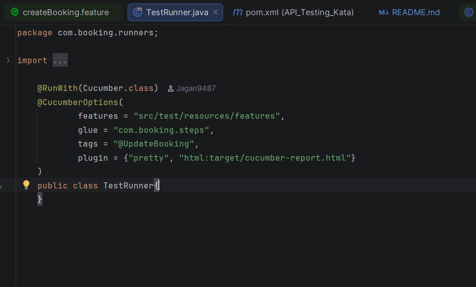
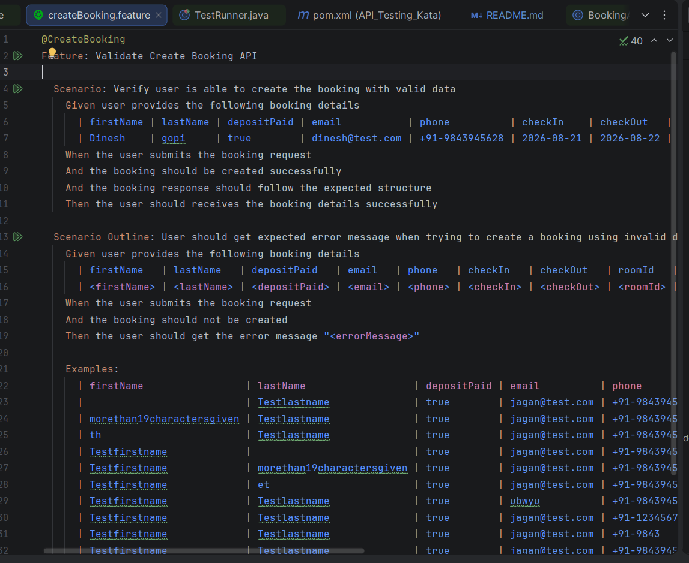

# Kata: Booking API Automation Framework in Java

A BDD-based API test automation framework developed using Java, Rest Assured, and Cucumber.
It validates core booking APIs such as create booking, retrieve booking, update booking, and delete booking.

## 1. Overview

This framework is built using a Behavior-Driven Development (BDD) approach, where test scenarios are written in plain English using Cucumber. This enables both technical and non-technical stakeholders to understand, contribute to, and validate API behavior.

### API Reference

**Base URL:** https://automationintesting.online/

**Booking Endpoints:**
- **Create Booking** — `POST /booking`
- **Get Booking by ID** — `GET /booking/{id}`
- **Update Booking** — `PUT /booking/{id}`
- **Delete Booking** — `DELETE /booking/{id}`

## 2. Technologies Used

- Java 21
- Maven 4.0.0
- Rest Assured 5.5.2
- JSON Schema Validator 5.4.0
- Cucumber 7.22.2
- JUnit Jupiter 5.12.2
- JUnit Platform Suite 1.12.2
- Lombok 1.18.30

## 3. Setup Guide

### Prerequisites
- Java 21
- Maven 4.0.0 or above
- Git

### Verify Installation
Ensure Java and Maven are correctly installed:
    java -version
    mvn -version

### Clone Repository
git clone <repository-url>
cd <project-folder>

### Open in IDE
- Open the project in IntelliJ IDEA / Eclipse
- Import it as a Maven project (if not auto-detected)
- Wait for dependencies to download

### Notes
- Reload the Maven project if dependencies are not resolved
- Ensure the correct Java version is configured in your IDE

## 4. Run configuration

### 1. Using TestRunner class
- Open `TestRunner.java`
- Provide the required tag in the `@CucumberOptions` annotation
- Run the TestRunner class

**Available Tags:**
- `@CreateBooking` — Create booking scenarios
- `@GetBooking` — Retrieve booking scenarios
- `@UpdateBooking` — Update booking scenarios
- `@DeleteBooking` — Delete booking scenarios
- `@Booking_CRUD_Operations` — End-to-end CRUD scenarios

### 2. Feature Files
- Open the desired feature file
- Click the green run icon next to a scenario or feature

### 3. Maven command line
    - Open terminal and navigate to the project root directory
    - Run the following command to execute all tests with a specific tag:
      mvn test -Dcucumber.filter.tags="@TagName"

## 5. Reporting

After execution, the Cucumber HTML report is available at: 
target/cucumber-reports.html

## 6. Test scenarios

- Create booking feature file contains both positive and negative scenarios for create booking endpoint.
- Get booking feature file contains both positive and negative scenarios for get booking endpoint.
- Update booking feature file contains both positive and negative scenarios for update booking endpoint.
- Delete booking feature file contains both positive and negative scenarios for delete booking endpoint.
- Booking CRUD operations feature file contains scenarios which cover all CRUD operations

## 7. Open Issues

Known issues and observations are documented under:
/src/resources